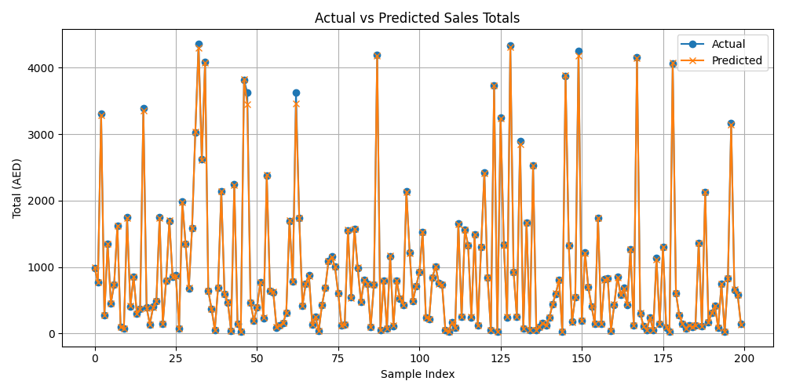

# 📊 Predict Sales AI Model

A simple machine learning project to predict future sales totals based on product, customer, quantity, and price using a Random Forest Regressor and Linear Regression. This project includes:

* Data preprocessing & model training
* Flask API for real-time predictions
* Visualization of prediction performance
* Easy setup & deployment-ready code

---

## 🗂️ Project Structure

```
predict_sales_ai_model/
├── api/
│    ├── routes
|    |    └──__init__.py
|    |    └──v1.py
|    ├── _init_.py
|    └── app.py
├── charts/
│   └── random_forest_prediction_vs_actual.png
├── data/
│   └── sales_50.csv
│   └── sales_1000.csv
├── model/
│   └──random_forest
|       ├── model.pkl
|       ├── model_columns.pkl
|       └── train_and_save.py
├── tests/
│   └── test_random_forest_model.py (optional)
├── requirements.txt
├── .gitignore
└── README.md
```

---

## 🔍 Features Used

* `product`: Product name (categorical)
* `customer`: Customer name (categorical)
* `quantity`: Number of units sold
* `price`: Price per unit

`total = quantity × price` is used as the prediction target.

---

## 🧠 Model Details

* **Algorithm**: Random Forest Regressor
* **Framework**: scikit-learn
* **Evaluation**:

  * Mean Absolute Error: \~19.82 AED
  * R² Score: 1.0 (excellent fit)

---

## 🧪 Training the Model

```bash
# Activate your virtual environment
python -m venv venv
venv\Scripts\activate  # On Windows

# Install dependencies
python -m pip install -r requirements.txt

# Train and save the model
python -m model.random_forest.train_and_save
```

---


## 🧪 Testing the Model

```bash
# Test the model
python -m tests.test_random_forest_model

```

---

## 🔮 Running the Flask API

```bash
python -m api.app
```

The API will start at: `http://127.0.0.1:5000/`

### ✅ Example cURL Request

```bash
curl -X POST http://127.0.0.1:5000/api/v1/predict -H "Content-Type: application/json" -d "{\"product\": \"Laptop\", \"customer\": \"John\", \"quantity\": 2, \"price\": 800}"
```

**Response**:

```json
{
  "predicted_total": 1520.0
}
```

✅ Single Input Example
```bash
curl -X POST http://127.0.0.1:5000/api/v1/predict -H "Content-Type: application/json"  -d '{"product": "Laptop", "customer": "John", "quantity": 2, "price": 800}'
```

**Response**:
```json
[
  {
    "index": 0,
    "predicted_total": 1520.0
  }
]
```

### ✅ Batch Input Example
```bash
curl -X POST http://127.0.0.1:5000/api/v1/predict  -H "Content-Type: application/json"  -d '[
       {"product": "Laptop", "customer": "John", "quantity": 2, "price": 800},
       {"product": "Tablet", "customer": "Alice", "quantity": 3, "price": 400},
       {"product": "Phone", "customer": "Mark", "quantity": 0, "price": 900}
     ]'
```
**Response**:
```json
[
  {
    "index": 0,
    "predicted_total": 1520.0
  },
  {
    "index": 1,
    "predicted_total": 1205.0
  },
  {
    "index": 2,
    "error": "Quantity must be a positive number."
  }
]
```
✅ Valid records will also be appended to data/new_sales.csv for future retraining purposes.

---

## 📈 Prediction Visualization



This chart compares actual and predicted sales totals on the test set.

---

## 📋 Requirements

```
Flask
pandas
scikit-learn
joblib
matplotlib
```

---

## 🚫 .gitignore

```
__pycache__/
*.pkl
.env
venv/
*.pyc
.DS_Store
```

---

## 📝 License

MIT License

---

## 🙌 Contributing

Pull requests are welcome. For major changes, please open an issue first to discuss what you would like to change.

---

## 👨‍💻 Author

**Shahzad**
Software Engineer | ML Enthusiast

---

For any questions or suggestions, feel free to reach out!
